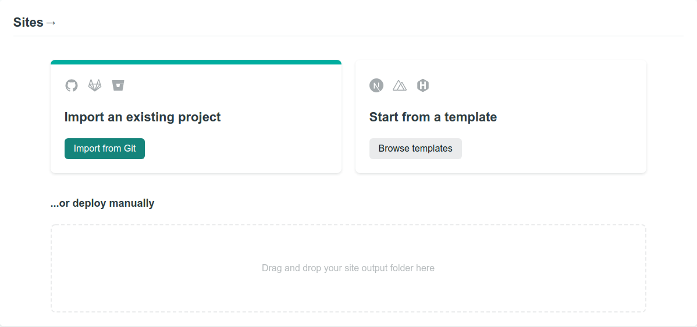
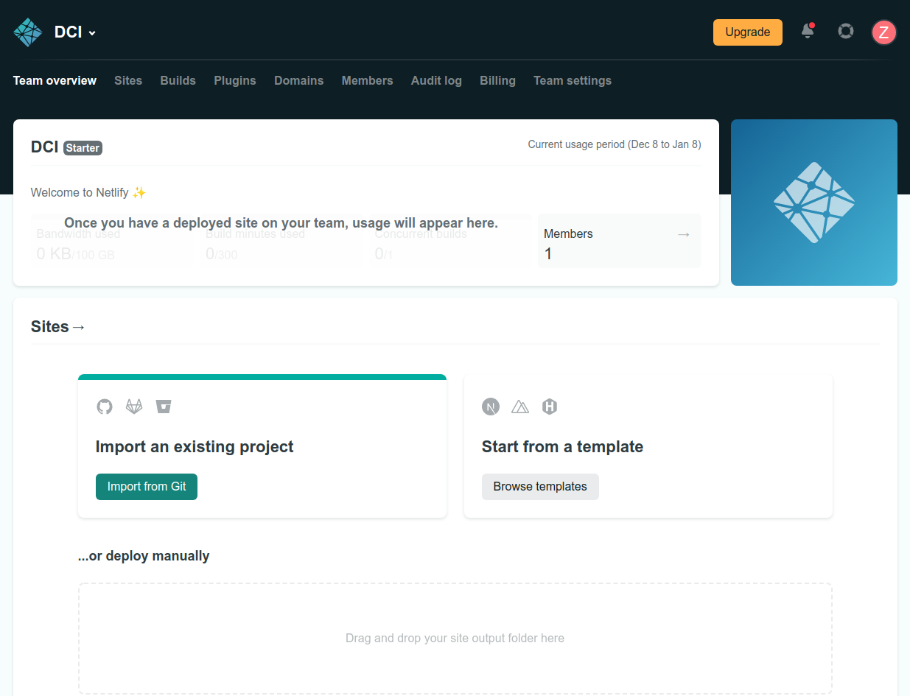
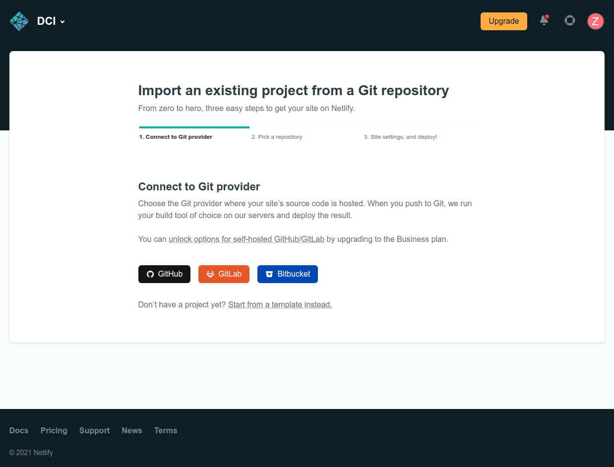
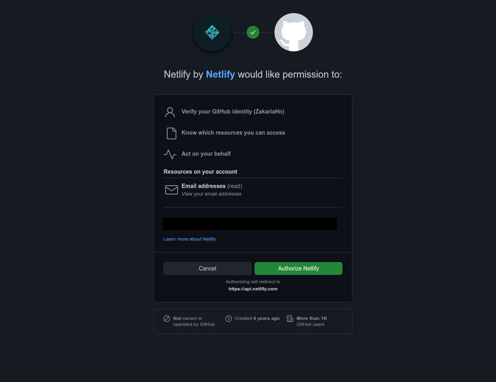
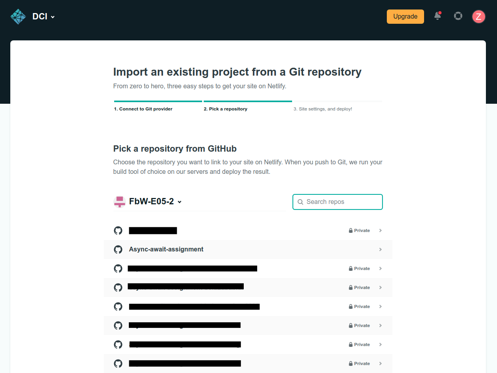
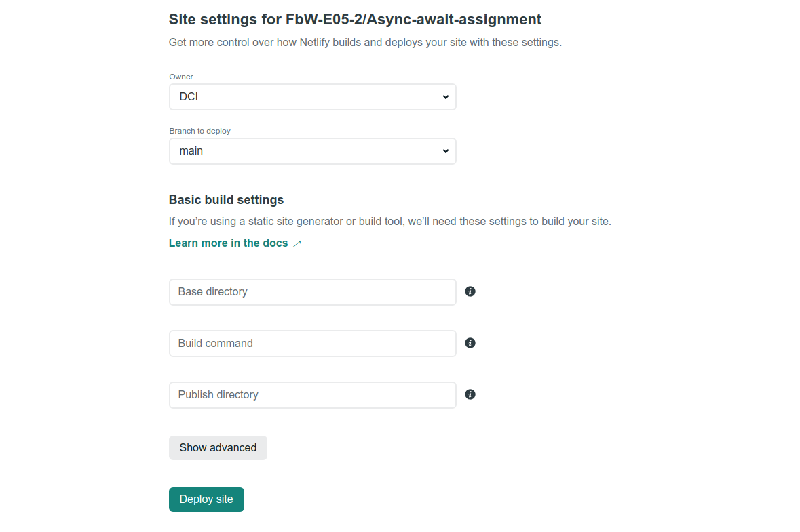
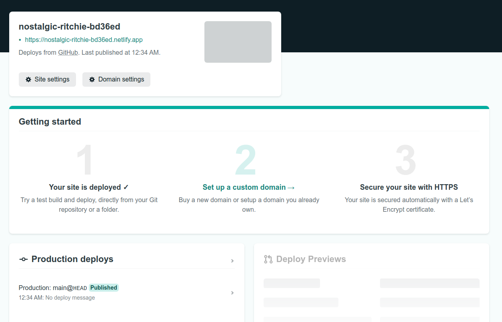
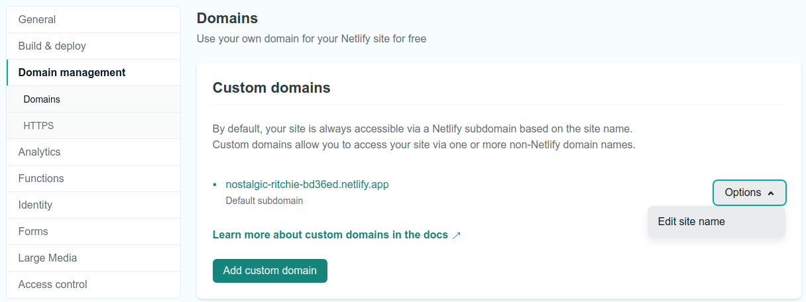
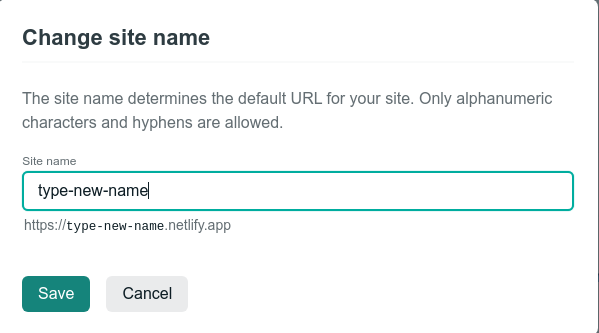

# A Step-by-Step Guide: Deploying on Netlify

This read-me file will guide you step by step to host a static website on Netlify, including
setting up continuous deployment.

 

## There are two ways to deploy an application on netlify:

 

## Manual deployment:

 

### 1. Build your application using the following command

    npm run build

 

### 2. Open your app with files explorer

 

### 3. Drag your `build` folder and drop it into the manual deployment box on netlifys web-page

 

 

 

## Continuous deployment:

 

Using this approach, your changes on the code will be reflected on the deployed version

 

### 1. Import an existing project from Github

 

 

### 2. Connect to git provider `Github`

 

 

### 3. Authorize Netlify to access your Github

 

### 4. Select a repository form Github

 

 

### 5. Site is ready to deploy, click on the green button `Deploy Site`

 

 

 

## After your app is deployed, you can edit the name of the app in the URL by:

### 1. Clicking on `Domain settings`

 

 

### 2. Clicking on `Options` and select `Edit site name`

 

 

### 2. Change the name and hit `Save`

 

 

#### Custom domains requires a paid account

### [Learn more about Netlify](https://agilitycms.com/resources/posts/what-is-netlify-and-why-should-you-care-as-an-editor)
