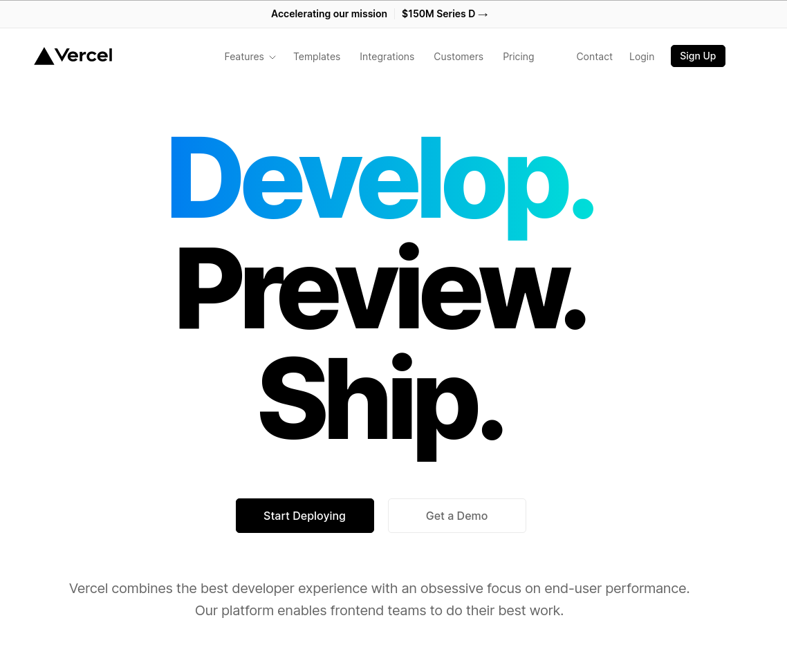
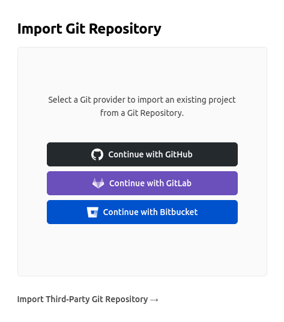
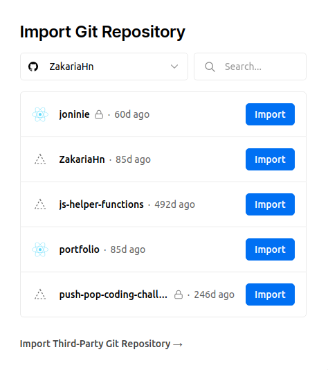
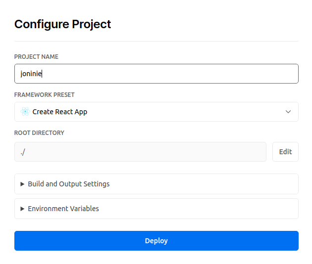

# A Step-by-Step Guide: Deploying on Vecrel

This read-me file will guide you step by step to host a static website on Vecrel

 

### 1. Visit https://vercel.com/ and hit `Start Deploying`

 

 

### 2. Connect to git provider `Github` and Authorize vercel to access your Github

 

 

### 3. Select a repository form Github

 

 

### 5. Site is ready to deploy, click on the blue button `Deploy`

 

 

 

### [Learn more about Vercel](https://vercel.com/docs)
